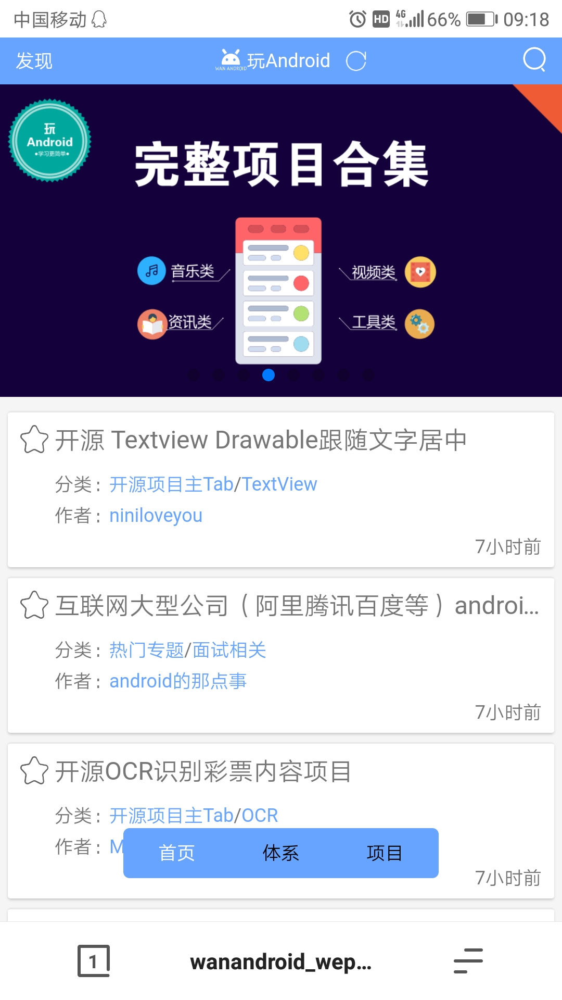

#### 引
作为一个Android开发，想转前端不容易啊，之前写几个简单的网页，后来参与微信小程序的开发，然而没个线上作品连面试机会都没有啊o(╥﹏╥)o。

其实之前已经拿着今日头条的Android版对照着打算撸一个一样的移动web端，然而功能多了点又不想精简功能，写了一部分觉得离上线好远啊，个人觉得一个完整的项目会比功能多不完整不能上线的项目更有价值，因此打算找一个功能少一点的项目做，很巧的是恰好收到了鸿洋大神公众号的推送开放了API，啊哈天助我也就它了，大概设计了一下页面布局就马上开撸，花了两个星期左右的下班时间今天终于能上线见人了o(╥﹏╥)o  感兴趣的同学随意fork或者给个star

由于没有iPhone，暂时没有对iPhone(尤其是iPhoneX刘海和小黑条)进行适配。

#### 技术栈：
本项目是以Vue为框架基础，结合Vue-router、Vuex、axios、ES6编写的单页应用，跨域通过服务器代理解决，项目使用vue-cli脚手架构建并添加了自适应。

#### 项目链接
地址：luogjytest.top
这是个移动端的webAPP，因此建议用手机浏览器打开。

#### TODO
* 加载优化，图片懒加载、首屏加载优化等
* 对一些已知bug进行修复
* 原网站在快速发展中，新功能不断添加，此项目开发期间会持续跟进
* 可能会加入登录和注册功能
* 对代码结构进一步优化
* 做成PWA(只做Service Worker的，Manifest貌似要淘汰了)

#### 效果图

#### 声明
本项目API均由[玩Android](http://www.wanandroid.com/)提供。
本项目仅供学习交流，不可用于任何商业用途。

#### Thanks
[鸿洋大神的博客](http://blog.csdn.net/lmj623565791/)
[玩Android](http://www.wanandroid.com/)

#### 我的博客
[Luogjy](https://segmentfault.com/u/luogjy)